## • Описание A/B теста:
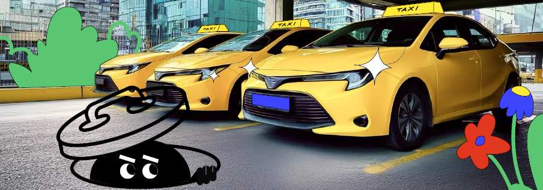
Таксопарк, работающий через мобильное приложение, столкнулся с проблемой нехватки водителей. Заказы от клиентов поступают без остановки, и таксопарк не справляется с нагрузкой. В связи с этим одни клиенты ждут подачи машины слишком долго, а другие отменяют поездку. Чтобы решить эту проблему, команда таксопарка решила внести изменение в систему и увеличить радиус поиска водителей с установленных 3 км до 5 км. Гипотеза: чем шире радиус поиска, тем выше шанс найти водителя на заказ. С другой стороны, имеется риск: увеличивая радиус поиска, увеличивается и время подачи машины, что может негативно отразиться на клиентском опыте. Для проверки гипотезы был проведен эксперимент на двух группах клиентов: в контрольной группе (0) радиус поиска остался 3 км, а в тестовой группе (1) радиус увеличили до 5 км. Клиенты могут создавать два типа заказов: срочные и отложенные.

Вам нужно проанализировать датасет с результатами эксперимента и решить несколько задач:
* расчитать результаты A/B теста и сделать вывод, выгодна ли новая механика с точки зрения продуктовых метрик
* убедиться, что система сплитования A/B теста сработала верно и разбила группы (контрольная и тестовая) случайным образом в отношении 50 на 50
* по окончании эксперимента была утеряна информация о типах заказов. Нужно предложить способ автоматического определения срочных и отложенных заказов
* изучить воздействие отложенных заказов на A/B тест

**! Все аналитические выводы должны быть подтверждены с точки зрения статистической значимости.**

> Продуктовая воронка:
> 
> 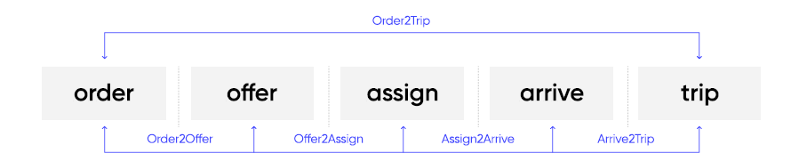  
>  
>* order - введена точка B, заказ создан
>* offer - заказ предложен первому водителю
>* assign - водитель согласился на назначение и был назначен на заказ
>* arrive - водитель прибыл в точку А и поставил статус "ожидание"
>* trip - водитель привез пассажира в точку B, заказ выполнен

Датасет A/B теста находится в файле **taxi_dataset.csv**  
Описание данных датасета находится в файле **description.txt**  
Решения задач находятся в файле **taxi_park_ab_test.ipynb** 

## • Результаты A/B теста

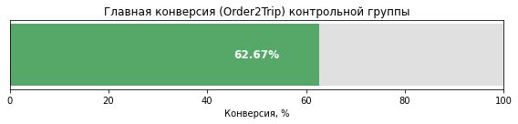
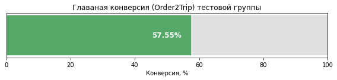

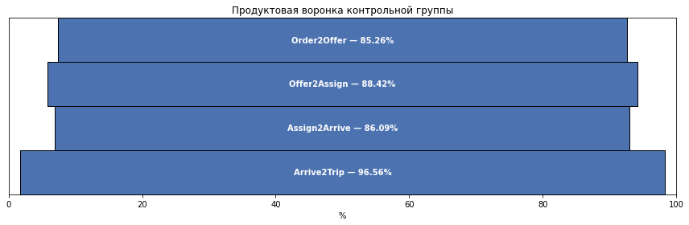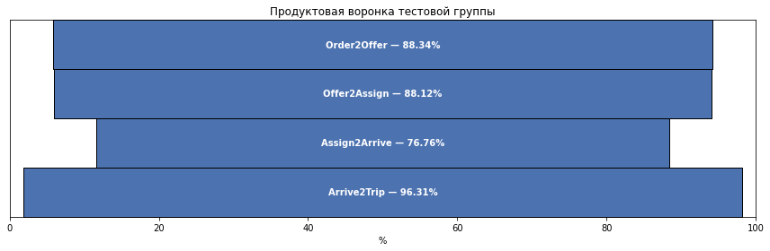

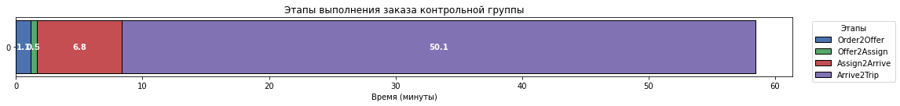
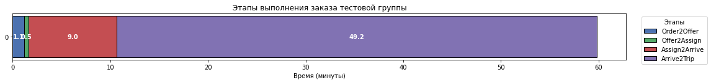

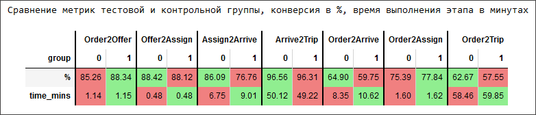

Результаты: Главная конверсия опустилась с 63% до 58%. Шанс найти водителя на заказ используя новую механику увеличился на 3%, но изза увеличения расстояния до клиента время подачи машины увеличилось в среднем на 2 минуты и это привело к тому что процент отмененых заказов в период ожидания увеличился с 14% до 23%.

Вывод: новая механика не оправдала себя. Хотя водителей и стали находить чаще, но сильно просело время ожидании машины, поэтому количество выполненных заказов сократилось на 8%. Не внедрять новую механику.

## • Работа сплит системы

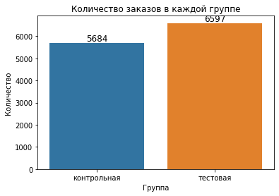

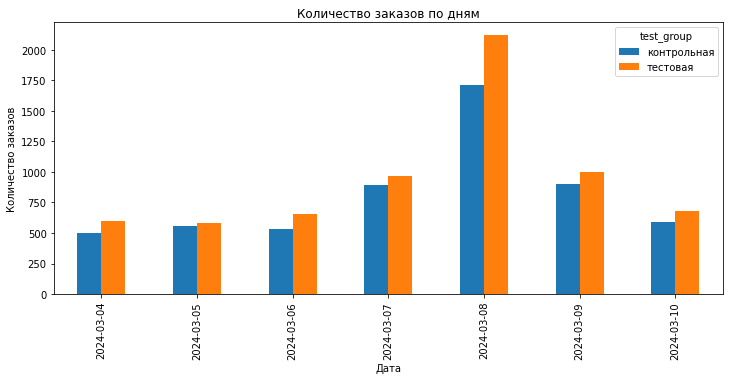

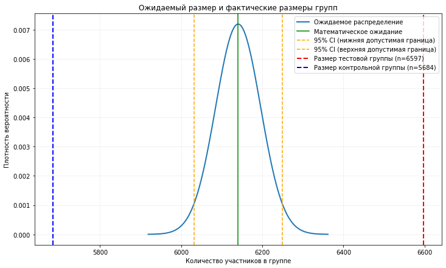

Результаты: 
Размер выборки достаточен для признания эксперемента состоявшимся. Мощность теста оставила 0.99. Но обнаружилось неравенство в размерах групп. Перекос в пользу тестовой группы составил 7,4% при максимально допустимых 1.76%. Перекос не был связан с конкретным днем и продолжался на протяжении всего времени эксперемента. Причиной перекоса оказалось то, что все отложенные заказы в количестве  643 оказались только в тестовой группе.

Вывод: сплит-система сработала неверно, и не разбила группы по принципу 50 на 50. Причиной этого стало, что все отложенные заказы попали в одну группу. Отложенные заказы стоит исключить из  расчета метрик A/B теста

## • Определение отложенных заказов

Для определения отложенных заказов я предложил гипотезу: у клиентов срочных заказов есть некий предел времени ожидания машины дольше которых они ждать не будут, и все что выше этой границы уже можно отнести к отложенным заказам. Поэтому я решил посмотреть распредление времени от создания заказов до подачи машин на первую точку, т.е. то самое время ожидания. На ней должно сформироваться две области, одна плотная возле нуля для срочных заказов, и вторая разряженная для отложенных заказов. График подтвердил мои ожидания. Дальше мне нужно было определить границу между этими областями чтобы точно определить критерий для отложенных заказов. Обычно в таких случаях границу определить сложно, ведь клиент может сделать отложенный заказ на близкое время и время ожидания впишиться в рамки ожидания на срочных заказах, и тогда области пересекутся. Но реальные данные экперимента показали большой разрыв между этими областями. Нет никаких значений между 19 минутой ожидания и 61. В таком случае я определил 19 минут как максимальное время ожидания срочных заказов. Но поскольку я имею только данные выборки, то в генеральной совокупности эти будут шире. Используя центральную предельную теорему я провел симулция генеральной совокупности и получил новое распределение срочных заказов. Рамка ожидания расширилась до 24 минут. Это значение и стало критерием для определения отложенных заказов

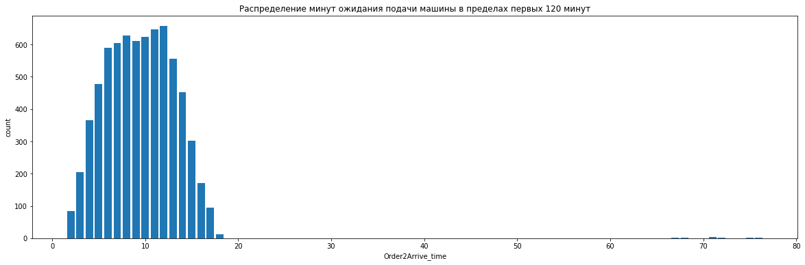

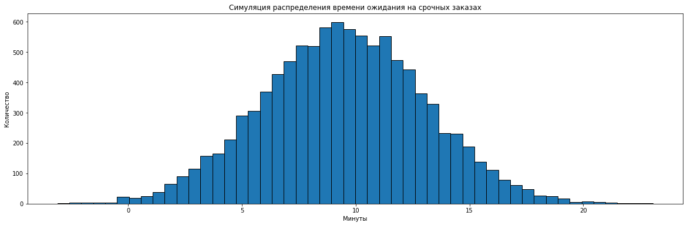

Вывод: в данных эксперемента виден значительный разрыв времени ожидания подачи машины который наступает после 24 минуты. Это граница для срочных заказов. Значит все что дольше можно считать отложенными. Поэтому я предлагаю следующий способ определения отложенных заказов: считать отложенными все те заказы, время в которых от создания заказа до подачи машины больше 24 минут.

## • Влияние отложенных заказов

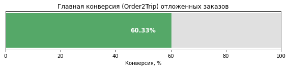

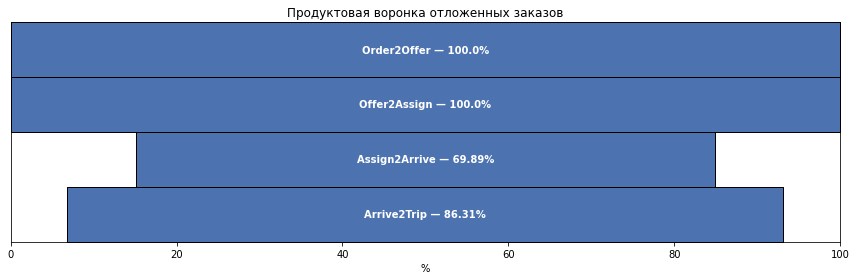

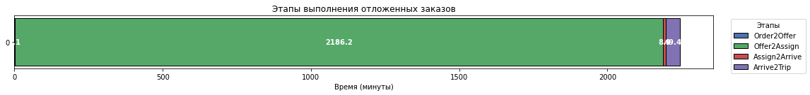

 Все отложенные заказы находились в тестовой группе, поэтому сравнивал я их со срочными заказами только тестовой группы.
 
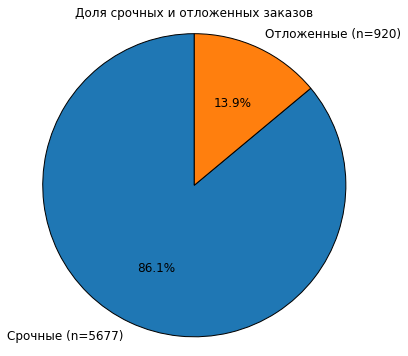

Результаты: главные конверсии отложенных и срочных заказов оказались равными, соответственно 60% и 58%. Разница в 2% не оказалась статистически значимой. Абсолютно все отложенные заказы (100%) находят водителя для исполнения, однако шанс того, что водитель доедет до первой точки всего 69%. Для сравнения в срочных заказах этот показатель больше и равен 76%.

Вывод: отложенные заказы не оказывают влияния на главную конверсию, и имеют такой же шанс на выполнение как и срочные. На отложенные заказы всегда находится водитель, однако 31% так и не приступают к его выполнению

