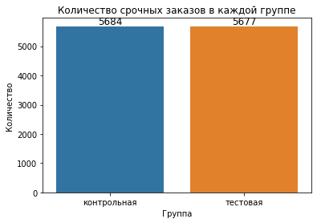

## • Описание A/B теста:

Таксопарк, работающий через мобильное приложение, столкнулся с проблемой нехватки водителей. Заказы от клиентов поступают без остановки, и таксопарк не справляется с нагрузкой. В связи с этим одни клиенты ждут подачи машины слишком долго, а другие отменяют поездку. Чтобы решить эту проблему, команда таксопарка решила внести изменение в систему и увеличить радиус поиска водителей с установленных 3 км до 5 км. Гипотеза: чем шире радиус поиска, тем выше шанс найти водителя на заказ. С другой стороны, имеется риск: увеличивая радиус поиска, увеличивается и время подачи машины, что может негативно отразиться на клиентском опыте. Для проверки гипотезы был проведен эксперимент на двух группах клиентов: в контрольной группе (0) радиус поиска остался 3 км, а в тестовой группе (1) радиус увеличили до 5 км. Клиенты могут создавать два типа заказов: срочные и отложенные.  

---
Вам нужно проанализировать датасет с результатами эксперимента и решить несколько задач:

* расчитать результаты A/B теста и сделать вывод, выгодна ли новая механика с точки зрения продуктовых метрик
* убедиться, что система сплитования A/B теста сработала верно и разбила группы (контрольная и тестовая) случайным образом в отношении 50 на 50
* по окончании эксперимента была утеряна информация о типах заказов. Нужно предложить способ автоматического определения срочных и отложенных заказов
* изучить воздействие отложенных заказов на A/B тест
  
**! Все аналитические выводы должны быть подтверждены с точки зрения статистической значимости.**

> Продуктовая воронка выполнения заказа:
> 
>   
>  
>* order - введена точка B, заказ создан
>* offer - заказ предложен первому водителю
>* assign - водитель согласился на назначение и был назначен на заказ
>* arrive - водитель прибыл в точку А и поставил статус "ожидание"
>* trip - водитель привез пассажира в точку B, заказ выполнен
---
Датасет A/B теста находится в файле **`taxi_dataset.csv`**  
Описание данных датасета находится в файле **`description.txt`**  
Jupyter notebook с кодом решения находится в файле **`taxi_park_ab_test.ipynb`**

## • Результаты A/B теста

При работе с имеющимися данными эксперимента я рассчитал все необходимые метрики для каждой группы и проанализировал те из них, которые позволяют дать ответы на поставленные задачи.. 

Нас интересовало, позволит ли новая механика увеличить шанс найти водителя на заказ. Для этого обратимся к метрике Order2Offer: этап, на котором система ищет водителей на созданный заказ. Эта метрика выросла на **3%**, с **85%** до **88%**. Новая механика действительно позволила незначительно, но увеличить шанс найти водителя. Метрики Order2Assign и Arrive2Trip остались без изменений. А вот метрика Assign2Arrive: этап, на котором водитель, принявший заказ, доезжает до точки подачи машины просела на **12%**, с **88%** до **76%**. Теперь водителям приходится преодолевать большее расстояние до первой точки, и клиенты, недовольные этим, стали чаще отменять заказы.

Так же я рассчитал среднее время выполнения каждого этапа заказа. И здесь тоже обратимся к метрике Assign2Arrive. Время подачи машины на первую точку увеличилось с **6,8** минут до **9**. Если эта разница может показаться несущественной, то я напомню, что мы имеем дело со срочными заказами, где в идеале клиенты рассчитывают на мгновенную подачу машины. Поэтому дополнительное ожидание в 2 с лишним минуты привело к увеличению шанса отмены заказа. Помимо увеличения расстояния, новая механика так же увеличила и время ожидания машины.

В итоге все это привело к тому что главная конверсия Order2Trip упала на **5%**, с **63%** до **58%**. Увеличение радиуса поиска оказало больше негативного эффекта чем положительного.

### `Вывод: новая механика оказалась невыгодна. Шанс найти водителя увеличился ненамного, а вот шанс, что клиенты готовы дожидаться водителя упал, и оказал гораздо большее влияние на общее выполнение заказов. Главная конверсия тестовой группы оказалась хуже контрольной на 5%. Новую механику не принимать.`

## • Работа сплит системы

При подсчете размеров групп сразу же бросилось в глаза, что имеется сильный перекос в сторону тестовой группы.

В тестовой группе оказалось на 913 человек больше. Сами размеры групп составили 5684 и 6597 человек в контрольной и тестовой группе соответственно. Процентная разница в 7,43%. При честном разделении 50 на 50 математическое ожидание размеров групп для нашей выборки составляет 6140 человек. Я решил рассчитать, на сколько допустимым может быть отклонение в 7,43%. Взяв за точность альфа равным 0,95, я получил результат, что допустимым отклонением от математического ожидания является максимум 1,76%, а в абсолютных величинах для нашей выборки 108 человек. Перекос же наших данных почти в 8 раз превышает допустимое значение. Честного разделения не произошло.

Я решил найти причину неправильного разделения групп. Первая гипотеза состояла в том, что размер выборки мог оказаться недостаточным для окончания эксперимента, и группы могли недобрать нужного количества человек. Но, проведя для этого расчет мощности теста (равен 0,99) размер выборки оказался достаточен для признания эксперимента оконченным. Вторая гипотеза, что перекос образовался в момент какого-то сбоя. Но проверка этой гипотезы показала, что распределение по группам не зависит от дня эксперимента. Перекос был системным и происходил на протяжении всего эксперимента.

Дальше я решил проверить распределение срочных и отложенных заказов по группам. И я обнаружил, что абсолютно все отложенные заказы попали именно в тестовую группу. Без них размеры групп практические равные и вписываются в допустимые значения честного распределения. Отложенные заказы в тестовой группе оказались истинной причиной сбоя сплит системы.

### `Вывод: сплит-система сработала неверно и не разбила группы по принципу 50 на 50. Разница в размерах между группами составила 7,43% при максимально допустимых 1,76%. Причиной этого стало то, что все отложенные заказы попали в тестовую группу. Для исключения влияния этой ошибки я исключил все отложенные заказы из расчета метрик A/B теста и рассмотрю отложенные заказы отдельно.`

## • Определение отложенных заказов

Для определения отложенных заказов я предложил гипотезу: у клиентов срочных заказов есть некий предел времени ожидания машины, дольше которых они ждать не готовы, и все, что выше этой границы, уже можно отнести к отложенным заказам. Поэтому я решил посмотреть разницу времени между созданием заказа и подачей машины на первую точку, т. е. то самое время ожидания для клиента. На ней должно сформироваться две области: одна плотная возле нуля для срочных заказов и вторая разряженная для отложенных заказов. 

График подтвердил мои ожидания. Имеется четкая область для срочных заказов и разрозненные точки вплоть до 4000 минут для отложенных заказов. Дальше мне нужно было найти границу между этими областями, чтобы точно определить критерий для отложенных заказов. Обычно в таких случаях границу определить сложно, ведь клиент может сделать отложенный заказ на близкое время и время ожидания впишется в рамки ожидания на срочных заказах, и тогда области пересекутся. Но реальные данные эксперимента показали большой разрыв между этими областями. Между значениями 19 минуты и 61 имеется пустая область. В таком случае я определил 19 минут как максимальное время ожидания срочных заказов. Но поскольку я имею только данные выборки, то в генеральной совокупности граница ожидания будет шире. Используя центральную предельную теорему, я провел симуляцию генеральной совокупности и получил новое распределение срочных заказов. Рамка ожидания расширилась до 24 минут. Это значение и стало критерием для определения отложенных заказов.

### `Вывод: в данных эксперимента виден значительный разрыв во времени ожидания подачи машины. Этот разрыв и можно принять как разделение на срочные и отложенные заказы. Я определил верхнюю границу срочных заказов как равную 24 минутам. Клиенты не готовы ждать машину на срочных заказах дольше этого времени. А значит всё, что больше этой границы можно отнести к отложенным заказам. Предлагаю способ определения отложенных заказов: считать таковыми все заказы в которых время метрики Order2Arrive превышает 24 минуты.`

## • Влияние отложенных заказов

Поскольку абсолютно все отложенные заказы попали в тестовую группу, то все они имели влияние новой механики. Поэтому изучать воздействие я буду только на срочные заказы, так же подверженные новой механике, т. е. внутри тестовой группы. У меня уже есть расчеты метрик срочных заказов, сделанные ранее. Теперь я рассчитаю те же метрики для отложенных заказов.

Главные конверсии отложенных и срочных заказов оказались равными. Видимая разница между 60% и 58% не оказалась статистически значимой.

Метрики отложенных заказов существенно отличаются. Оказалось, что на отложенных заказах система всегда найдет водителей для предложения заказа (Order2Offer = 100%) и все заказы получают назначение водителя (Offer2Assign = 100%). Но вот дальше воронка резко проваливается со 100% до 69% (Assign2Arrive). Это значит, что 31% водителей, согласившись взять отложенный заказ, не доезжают до первой точки и не выполняют его. В срочных заказах доля таких водителей только 12%. Что послужило причиной такого провала, определить невозможно изза недостатка данных. Возможно, клиенты чаще отменяют отложенные заказы, а возможно, водители отказываются или забывают про них.

Среднее время подачи машины в 2186 минуты не имеет никакого значения и влияния, так как распределение на отложенных заказ не имеет никакой формы и состоит из случайных величин.

### `Вывод: отложенные заказы не оказывают влияния на главную конверсию и имеют такой же шанс на выполнение, как и срочные. На отложенные заказы всегда находится водитель для исполнения, однако 31% из них так и не доезжают до первой точки. На срочных заказах доля таких только 12%.`

